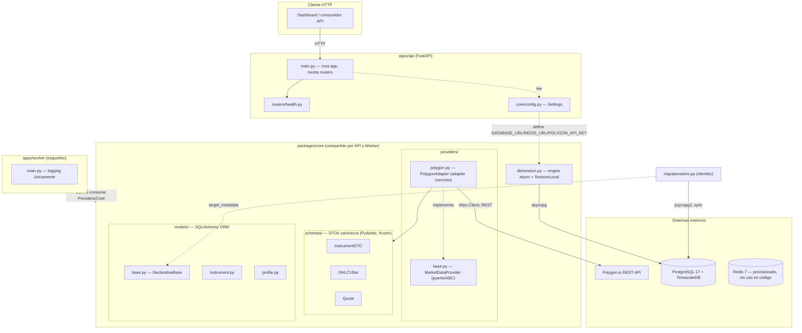
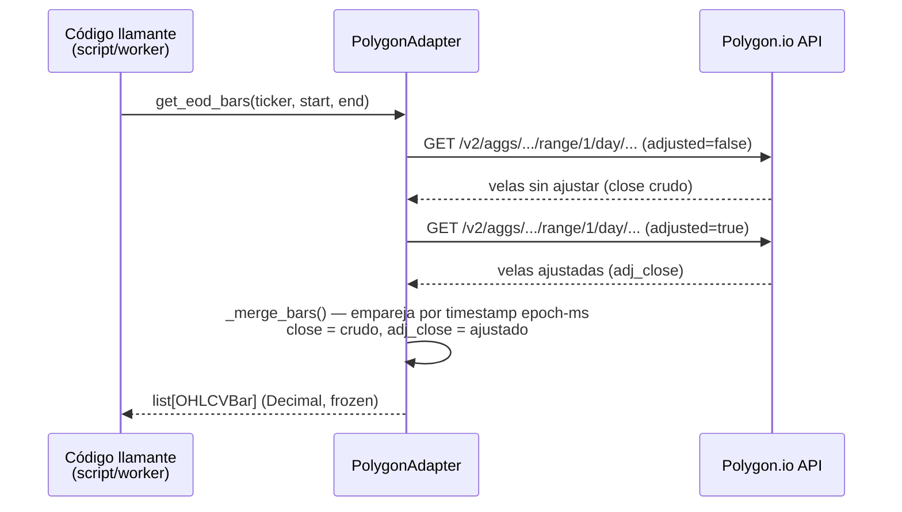

# Arquitectura del Backend — Flash Research

> Estado del código a la fecha de este documento: commit `001dfd9` (rama `app/doc`).
> Este documento describe lo que existe en el repo hoy. Donde algo está en esqueleto
> o sin implementar, se indica explícitamente — no se documentan features futuras
> como si ya existieran.

## 1. Visión general

Flash Research es una plataforma de inteligencia para *momentum trading*: escaneo de
mercado NYSE/NASDAQ, métricas cuantitativas y un dashboard en tiempo real. Este repo
contiene el backend, estructurado como un **monorepo con dos deployables** que
comparten un paquete de código común:

| Deployable | Ruta | Rol | Estado |
|---|---|---|---|
| **API** | `apps/api` | Cara HTTP (FastAPI) | Implementado (endpoint `/health` únicamente) |
| **Worker** | `apps/worker` | Ingesta y cálculos batch | Esqueleto (`main.py` solo loguea "worker up") |
| **`packages/core`** | `packages/core` | Modelos SQLAlchemy, schemas Pydantic, adapters de proveedores de datos | Implementado (modelos, DTOs, adapter de Polygon) |

## 2. Stack

| Capa | Tecnología |
|---|---|
| Lenguaje | Python 3.12+ |
| API | FastAPI + Uvicorn |
| ORM | SQLAlchemy 2.x (estilo `Mapped`/`mapped_column`) |
| Driver DB (app, async) | asyncpg |
| Driver DB (Alembic, sync) | psycopg2-binary |
| Migraciones | Alembic |
| Validación / DTOs | Pydantic v2 (`pydantic-settings` para config) |
| Cliente HTTP | httpx |
| Gestor de deps | uv |
| Base de datos | PostgreSQL 17 + extensión TimescaleDB |
| Cache / bus | Redis 7 (provisionado en Docker Compose; **sin uso en código todavía** más allá de `settings.redis_url`) |
| Lint/format | Ruff (`select = ["E","F","I","UP","B","SIM"]`, `E501` ignorado, line-length 100) |
| Tests | pytest + pytest-asyncio + respx (mock de HTTP) |
| Infra local | Docker Compose (Postgres+TimescaleDB, Redis) |
| CI | GitHub Actions (`.github/workflows/ci.yml`) |

## 3. Estructura de carpetas

```
apps/
  api/
    main.py             # crea la FastAPI app, monta routers
    core/config.py       # Settings (pydantic-settings) desde variables de entorno
    routers/health.py    # GET /health, GET /
  worker/
    main.py              # esqueleto — logging "worker up", sin lógica de negocio
packages/
  core/
    db/
      session.py          # engine async + sessionmaker (asyncpg)
    models/
      base.py              # DeclarativeBase compartida
      instrument.py         # tabla instruments
      profile.py            # tabla profiles
    providers/
      base.py               # puerto MarketDataProvider (ABC)
      polygon.py            # adapter concreto para Polygon.io
    schemas/
      instrument.py          # InstrumentDTO
      market.py               # OHLCVBar, Quote
migrations/
  env.py                # bootstrap de Alembic (lee DATABASE_URL, target_metadata = Base.metadata)
  versions/              # 0001_initial_schema.py, 0002_add_instrument_type.py
scripts/
  smoke_polygon.py        # script manual: llama a la API real de Polygon
tests/
  test_health.py
  test_polygon_adapter.py
  fixtures/                # JSON de respuestas de Polygon usadas en tests
docker-compose.yml       # Postgres+TimescaleDB + Redis para desarrollo local
```

## 4. Diagrama de componentes



**Notas del diagrama:**
- El `Worker` está deliberadamente desconectado del resto en el código actual: no importa `packages/core`, no usa el `PolygonAdapter` ni escribe a la base de datos todavía. La flecha punteada refleja la integración *prevista* por la estructura del monorepo, no código existente.
- `apps/api` tampoco usa `packages/core/db/session.py` ni los modelos ORM todavía — el único router activo (`/health`) no toca la base de datos.
- Redis está en `docker-compose.yml` y en `Settings.redis_url`, pero ningún módulo de Python lo importa o lo usa como cache o bus de mensajes aún.

## 5. Patrón arquitectónico: puerto y adapter para datos de mercado

El núcleo del diseño en `packages/core` es un **puerto/adapter** (hexagonal) para
proveedores de datos de mercado:

- **Puerto** (`providers/base.py`): `MarketDataProvider`, una clase abstracta (ABC)
  con dos métodos — `list_instruments()` y `get_eod_bars(ticker, start, end)`. El
  resto del sistema debe depender únicamente de esta interfaz.
- **Adapter concreto** (`providers/polygon.py`): `PolygonAdapter` es el único punto
  del sistema que conoce el formato de la API de Polygon.io (endpoints, parámetros,
  formato de respuesta, mapeo de MIC → exchange). Cambiar de proveedor de datos
  implica escribir otro adapter que implemente el mismo puerto, sin tocar
  consumidores.
- **DTOs canónicos** (`schemas/`): `InstrumentDTO`, `OHLCVBar`, `Quote` son modelos
  Pydantic `frozen=True` que representan el formato interno, agnóstico del
  proveedor. Los adapters traducen la respuesta cruda del proveedor a estos DTOs;
  ningún otro módulo debería construir estos objetos a partir de payloads crudos.

Dentro de `PolygonAdapter`, el código separa dos capas explícitamente:

1. **Capa HTTP** (`_get`, `_get_aggs`, `list_instruments`, `get_eod_bars`) — toca la
   red vía un único `httpx.Client` reusado (evita reabrir DNS+TCP+TLS por request).
2. **Capa de traducción pura** (`_parse_instruments`, `_merge_bars`, métodos
   `staticmethod`) — sin I/O, testeable con fixtures JSON sin mockear red.

Esta separación es la razón por la que `tests/test_polygon_adapter.py` puede probar
la lógica de traducción directamente (sin red) y solo usa `respx` para los tests que
ejercitan los métodos públicos HTTP.

### Secuencia: obtener velas EOD de un ticker



`_merge_bars` hace *fallback* al close crudo si falta el timestamp correspondiente
en la respuesta ajustada.

### Secuencia: catálogo de instrumentos paginado

```mermaid
sequenceDiagram
    participant Caller as Código llamante
    participant Adapter as PolygonAdapter
    participant API as Polygon.io API

    Caller->>Adapter: list_instruments(max_pages)
    loop hasta agotar next_url o max_pages
        Adapter->>API: GET /v3/reference/tickers (cursor)
        API-->>Adapter: results[] + next_url
        Adapter->>Adapter: _parse_instruments() → InstrumentDTO[]
        Note over Adapter: next_url no preserva `limit`;<br/>se extrae el cursor y se re-aplica base_params
    end
    Adapter-->>Caller: list[InstrumentDTO]
```

## 6. Configuración

`apps/api/core/config.py` define `Settings` (pydantic-settings), que lee de `.env`:
`database_url`, `redis_url`, `debug`, `polygon_api_key`, `polygon_base_url`. Es el
punto único recomendado para leer configuración en código de aplicación — evita leer
`os.environ` directamente salvo en `db/session.py`, que lo hace por necesidad de
compartir `DATABASE_URL` con Alembic (ver `database.md`).

## 7. Testing

- `tests/test_health.py` — test de integración liviano con `TestClient` de FastAPI
  contra la app real (sin mocks, sin DB).
- `tests/test_polygon_adapter.py` — separa tests de la capa pura de traducción
  (sin red, usando fixtures en `tests/fixtures/*.json`) de tests de los métodos
  públicos HTTP (interceptados con `respx`, sin red real).
- CI (`.github/workflows/ci.yml`) levanta un contenedor real de
  `timescale/timescaledb:latest-pg17` como servicio y corre
  `ruff check . → alembic upgrade head → pytest` — las migraciones deben aplicar
  limpiamente en cada PR, no solo pasar tests con mocks.

## 8. Convenciones que afectan el diseño

- **Precios y montos siempre `Decimal`, nunca `float`** — validado a nivel de schema
  (`OHLCVBar`) y en la conversión del adapter (`_to_decimal` vía `str()`).
- **Instrumentos delistados nunca se borran** (`is_active=false`) — evita
  *survivorship bias* en backtests futuros.
- **Cambios de esquema solo vía Alembic** — sin SQL manual fuera de migraciones.
- Ver `database.md` para el detalle de modelo de datos y `communication.md` para
  los flujos de comunicación end-to-end.
