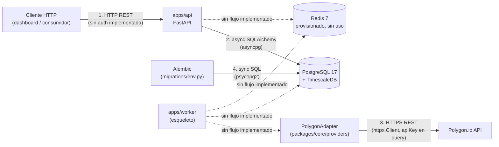
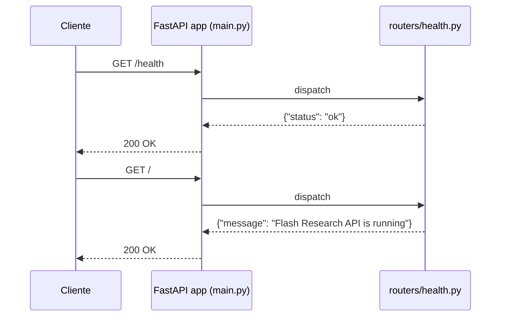
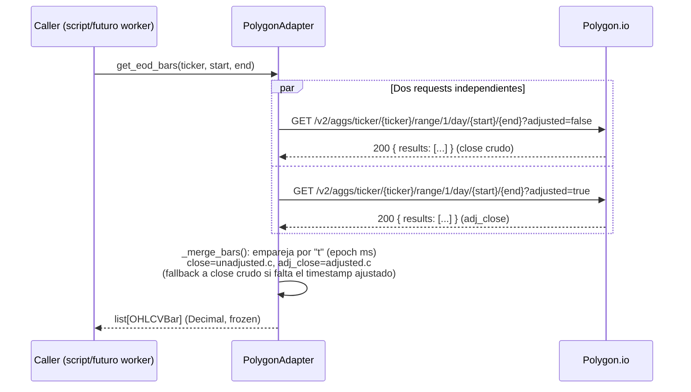
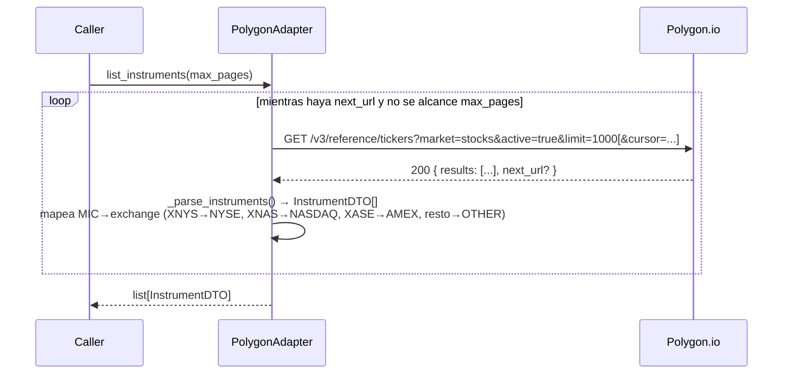

# Flujos de comunicación — Flash Research

> Estado a la fecha de este documento (commit `001dfd9`, rama `app/doc`). Este
> documento cubre los flujos de comunicación que existen realmente en el código:
> cliente HTTP → API, adapter → Polygon.io, y app → base de datos. El worker y
> Redis están provisionados pero no tienen ningún flujo de comunicación
> implementado todavía — se indica explícitamente dónde.

## 1. Mapa de flujos

Numerado, los flujos **realmente implementados** hoy son: (1) cliente → API HTTP,
(2) — existe la infraestructura (`db/session.py`) pero **ningún router la usa
todavía** (`/health` no toca la DB), (3) adapter Polygon → API externa, y (4)
Alembic → DB para migraciones. Todo lo punteado es infraestructura provisionada
(Docker Compose, dependencias) sin código que la conecte aún.

## 2. Cliente → API (HTTP)

`apps/api/main.py` crea la instancia de FastAPI y monta el router de `health`.
Único flujo activo hoy:

No hay autenticación, autorización, ni middleware de request/response configurados
en `main.py` más allá del router. No hay otros endpoints de negocio (instrumentos,
velas, perfiles) expuestos todavía — esos datos solo son accesibles hoy vía el
`PolygonAdapter` en código Python (script `scripts/smoke_polygon.py`) o
directamente en la base de datos.

## 3. Adapter → Polygon.io (proveedor de datos de mercado externo)

Es el único flujo de comunicación saliente a un sistema de terceros. Todo pasa por
`PolygonAdapter` (`packages/core/providers/polygon.py`), que reutiliza un único
`httpx.Client` (mismo pool de conexiones/DNS/TLS para todas las llamadas) y agrega
`apiKey` como query param en cada request (`_get`).

### 3.1 Velas EOD (`get_eod_bars`)

Nota: aunque el diagrama muestra las dos llamadas como conceptualmente paralelas,
`get_eod_bars` las hace secuencialmente en el código (`raw_unadjusted` primero,
luego `raw_adjusted`).

### 3.2 Catálogo de instrumentos (`list_instruments`)

`next_url` de Polygon no preserva el `limit=1000` original (cae al default de la
API), así que el adapter extrae solo el `cursor` de `next_url` y reconstruye los
`params` con `base_params` para no perder el tamaño de página.

### 3.3 Manejo de errores

`_get()` llama `resp.raise_for_status()` — cualquier respuesta HTTP de error de
Polygon (401, 429, 5xx, etc.) propaga como `httpx.HTTPStatusError` hacia el
llamador. No hay retry ni backoff implementado en el adapter.

## 4. Aplicación → Base de datos

- **Runtime (API/worker):** `packages/core/db/session.py` expone `SessionLocal`
  (`async_sessionmaker` sobre un `AsyncEngine` con `asyncpg`, `pool_pre_ping=True`).
  Ningún router usa esta sesión todavía — es infraestructura lista pero no
  conectada a ningún endpoint.
- **Migraciones:** `migrations/env.py` abre su propia conexión síncrona
  (`psycopg2`, vía `engine_from_config`) directamente desde `DATABASE_URL`, fuera
  del ciclo de vida de la app. Ver `database.md` §1 para el detalle de por qué
  usan drivers distintos.
- **RLS:** las queries sobre `profiles` requieren `SET LOCAL app.current_user_id =
  '<uuid>'` en la misma transacción para que las policies de RLS filtren
  correctamente (ver `database.md` §5). Este `SET LOCAL` **no está implementado**
  en `db/session.py` — es responsabilidad de código que aún no existe (p. ej. un
  middleware o dependency de FastAPI que identifique al usuario autenticado).

## 5. Redis y Worker — provisionados, sin flujo implementado

- `docker-compose.yml` levanta Redis 7 (`flash_redis`, puerto `6379`) y
  `Settings.redis_url` apunta a él por defecto, pero **ningún módulo de Python
  importa una librería de Redis ni abre una conexión**. No hay cache ni bus de
  mensajes funcionando.
- `apps/worker/main.py` es un esqueleto: solo configura logging y loguea
  `"worker up"`. No importa `packages/core`, no llama al `PolygonAdapter`, no
  escribe a la base de datos, y no se comunica con la API ni con Redis. El flujo
  previsto (worker ingiere de Polygon vía el adapter → persiste en Postgres vía
  los modelos ORM → posiblemente notifica a la API vía Redis) es una inferencia de
  la estructura del monorepo, no un flujo implementado — no debe documentarse ni
  asumirse como existente en el código.

## 6. Comunicación manual / fuera de la app

`scripts/smoke_polygon.py` es un script de humo que se ejecuta manualmente
(`uv run python scripts/smoke_polygon.py`), fuera del ciclo de vida de la API o el
worker. Requiere `POLYGON_API_KEY` en `.env`, instancia `PolygonAdapter`
directamente y llama a `get_eod_bars` y `list_instruments` contra la API real de
Polygon (no contra fixtures) — es la única forma actual de ejercitar el adapter
contra el proveedor real fuera de los tests.
