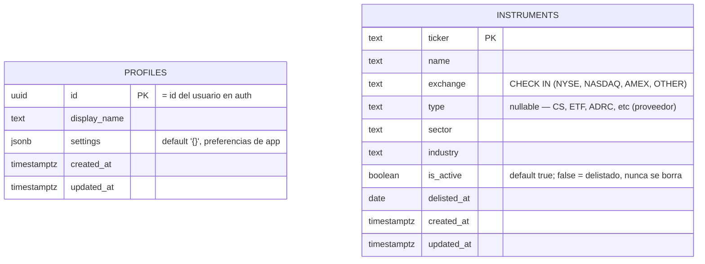

# Base de datos — Flash Research

> Estado a la fecha de este documento: migraciones `0001_initial_schema` y
> `0002_add_instrument_type` (commit `001dfd9`, rama `app/doc`). Solo se documentan
> tablas y columnas que existen realmente en las migraciones — no se documentan
> tablas planeadas (p. ej. velas OHLCV persistidas) que aún no tienen migración.

## 1. Motor y gestión

| Aspecto | Detalle |
|---|---|
| Motor | PostgreSQL 17 con extensión **TimescaleDB** (activada en `0001`, `CREATE EXTENSION IF NOT EXISTS timescaledb`) |
| ORM | SQLAlchemy 2.x, estilo `Mapped`/`mapped_column`, `DeclarativeBase` en `packages/core/models/base.py` |
| Migraciones | Alembic. **Todo cambio de esquema pasa por una migración** — las migraciones existentes están escritas como bloques `op.execute()` de SQL crudo, no con los helpers declarativos (`op.create_table`), excepto `0002` que sí usa `op.add_column`. |
| Driver en runtime (API/worker) | `asyncpg`, vía `packages/core/db/session.py` |
| Driver en Alembic | `psycopg2-binary` (síncrono) |
| Infra local | `docker-compose.yml` — contenedor `flash_db` (`timescale/timescaledb:latest-pg17`), puerto `5432`, credenciales dev `flash` / `flash_dev_pw` / DB `flash_research` |

### Async (app) vs. sync (Alembic)

`packages/core/db/session.py` reescribe la URL de conexión para forzar el driver
async:

```python
def _async_url() -> str:
    url = os.environ.get("DATABASE_URL", _DEFAULT_URL)
    if url.startswith("postgresql://"):
        return url.replace("postgresql://", "postgresql+asyncpg://", 1)
    return url
```

`migrations/env.py`, en cambio, usa `DATABASE_URL` tal cual (sin reescritura), porque
Alembic corre con el driver síncrono `psycopg2`. **Ambos leen la misma variable de
entorno `DATABASE_URL`**, pero cada uno la usa con su propio driver — es la única
razón por la que `db/session.py` lee `os.environ` directamente en vez de usar
`Settings` de `apps/api/core/config.py`.

`SessionLocal` (el `async_sessionmaker`) se crea con `expire_on_commit=False`: los
objetos ORM siguen siendo legibles tras un `commit()` sin requerir una nueva consulta.

## 2. Diagrama entidad-relación



**No hay relación FK entre `profiles` e `instruments` hoy.** Son dos tablas
independientes; cualquier relación (watchlists, portfolios, etc.) todavía no existe
en el esquema.

## 3. Tablas

### `profiles`

Perfil de usuario, 1:1 con el usuario de auth (comentario en la migración: *"Perfil
de usuario, 1:1 con el usuario de auth"*).

| Columna | Tipo | Constraints | Notas |
|---|---|---|---|
| `id` | `UUID` | PK | Coincide con el id del usuario de auth (no hay FK física — se asume gestión externa, p. ej. Supabase Auth) |
| `display_name` | `TEXT` | nullable | |
| `settings` | `JSONB` | `NOT NULL DEFAULT '{}'` | Preferencias de app del usuario |
| `created_at` | `TIMESTAMPTZ` | `NOT NULL DEFAULT now()` | |
| `updated_at` | `TIMESTAMPTZ` | `NOT NULL DEFAULT now()` | Actualizado por trigger `trg_profiles_updated` |

### `instruments`

Catálogo de tickers. Los delistados se marcan `is_active=false`, **nunca se borran**
(evita *survivorship bias* en backtests).

| Columna | Tipo | Constraints | Notas |
|---|---|---|---|
| `ticker` | `TEXT` | PK | |
| `name` | `TEXT` | `NOT NULL` | |
| `exchange` | `TEXT` | `NOT NULL`, `CHECK (exchange IN ('NYSE','NASDAQ','AMEX','OTHER'))` | Normalizado desde el MIC del proveedor (ver `communication.md`) |
| `type` | `TEXT` | nullable | Añadida en `0002`. Tipo crudo del proveedor (`CS`, `ETF`, `ADRC`, ...), para filtrar el universo |
| `sector` | `TEXT` | nullable | |
| `industry` | `TEXT` | nullable | |
| `is_active` | `BOOLEAN` | `NOT NULL DEFAULT TRUE` | `FALSE` = delistado |
| `delisted_at` | `DATE` | nullable | |
| `created_at` | `TIMESTAMPTZ` | `NOT NULL DEFAULT now()` | |
| `updated_at` | `TIMESTAMPTZ` | `NOT NULL DEFAULT now()` | Actualizado por trigger `trg_instruments_updated` |

**Índices:**
- `idx_instruments_active` — parcial, `WHERE is_active` (acelera el filtro más común: solo activos)
- `idx_instruments_exchange` — sobre `exchange`
- `idx_instruments_sector` — sobre `sector`

## 4. Triggers y funciones

```sql
CREATE OR REPLACE FUNCTION set_updated_at()
RETURNS TRIGGER AS $$
BEGIN
    NEW.updated_at = now();
    RETURN NEW;
END;
$$ LANGUAGE plpgsql;
```

Aplicada como `BEFORE UPDATE` en ambas tablas (`trg_profiles_updated`,
`trg_instruments_updated`) — `updated_at` se mantiene en la base de datos, no en la
capa de aplicación.

## 5. Row-Level Security (RLS)

Ambas tablas tienen RLS habilitado (`ALTER TABLE ... ENABLE ROW LEVEL SECURITY`).

### `profiles` — acceso por usuario

| Policy | Operación | Regla |
|---|---|---|
| `profiles_select_own` | `SELECT` | `id = current_setting('app.current_user_id', true)::uuid` |
| `profiles_update_own` | `UPDATE` | mismo predicado |
| `profiles_insert_self` | `INSERT` | `WITH CHECK` mismo predicado |

El backend debe hacer `SET LOCAL app.current_user_id = '<uuid>'` en cada transacción
para que estas policies apliquen — **este `SET LOCAL` no está implementado aún en
`packages/core/db/session.py`**; es responsabilidad de quien use `SessionLocal` para
queries sobre `profiles`. El comentario en la migración señala que si se migra a
Supabase Auth, `current_setting('app.current_user_id', true)` se reemplazaría por
`auth.uid()`.

### `instruments` — catálogo de lectura pública

| Policy | Operación | Regla |
|---|---|---|
| `instruments_read_all` | `SELECT` | `USING (true)` — lectura abierta a cualquier rol |

No hay policy de `INSERT`/`UPDATE` para `instruments`: la escritura está pensada
para ejecutarse con el rol de servicio de Postgres, que **bypassa RLS** por defecto
(comentario en la migración: *"Escritura solo con rol de servicio (bypassa RLS)"*).

## 6. Historial de migraciones

| Revisión | Descripción | Cambios |
|---|---|---|
| `0001` | initial schema: profiles, instruments, RLS | Activa TimescaleDB; crea `set_updated_at()`; crea `profiles`, `instruments` con sus índices y triggers; habilita y define policies de RLS en ambas tablas |
| `0002` | add type column to instruments | `ALTER TABLE instruments ADD COLUMN type TEXT` (nullable, con comment) |

`down_revision` encadena `0002 → 0001 → None`, es decir, la cadena de migraciones es
lineal (sin branches) hasta hoy.

## 7. Convenciones de esquema

- **Cambios de esquema solo con Alembic** — nunca SQL manual fuera de una migración
  versionada.
- **Numeric, nunca float, para precios/montos.** Ninguna tabla actual persiste
  precios todavía (las velas OHLCV solo existen como DTO `OHLCVBar` en memoria — ver
  `architecture.md` §5 y `communication.md`); cuando se agregue una tabla de velas,
  debe usar `NUMERIC`, siguiendo el mismo patrón que `OHLCVBar.close: Decimal` en
  Pydantic.
- **Instrumentos delistados nunca se eliminan** — solo `is_active=false` +
  `delisted_at`.
- El registro de tablas conocidas por SQLAlchemy (`Base.metadata`, importado en
  `packages/core/models/__init__.py`) es lo que Alembic usa como
  `target_metadata` para `autogenerate` — cualquier modelo nuevo debe agregarse a
  ese `__init__.py` para que Alembic lo detecte.
